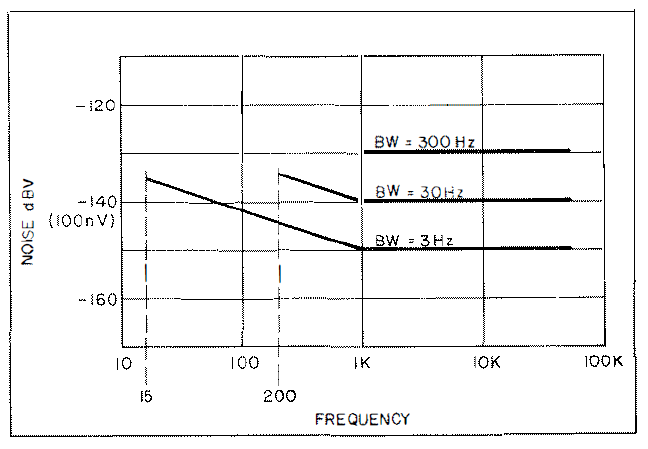

# Measuring Extremely Low Noise Sources

This information relates to tools and techniques related to measuring low noise sources.  Of course 
this is useful in most any discipline where low noise needs to be quantified, but the origin of the 
study in my case is low noise audio amplifiers.  Case in point is [Lilienfeld's Choir](http://auteuraudio.com/lilienfelds-choir) 
that I market under the [Auteur Audio](http://auteuraudio.com/) brand, which exhibits a full wideband
unweighted noise level of about 1.7uV RMS into 33 ohms inclusive of spurious 60 Hertz measurement
pickup not related to the noise of the amplifier (lead pickup).

If you look at the spectral graph, particularly in the lower frequency range, say from 100 to 500 Hertz
(discounting the 180 Hertz power line harmonic), you will note that the actual noise density is 
quite low, nearly -150dBV.  This equates to a slightly better than -120dBV wideband audio performance, which
is pretty good.  Pretty good in part because this figure equates to >120dB SNR for typical listening 
levels (rather than maximum output, which is often the improbable output level typically reported).  If 
you have ever paid attention to the specifications on 
[Audio Precision's high end gear](https://www.ap.com/analyzers-accessories/apx555/), you may note that 
this is getting pretty close to the limits of resolution.  It might be a little tricky
to trust these measurements of this amplifier from 
[PrismSound's dScope gear](http://www.prismsound.com/test_measure/products_subs/dscope/dscope_spec.php)
because of the slightly higher noise floor.  All in all, pretty good performance for an amplifier if 
you have to exercise such care with such quality test equipment.

What all this means is that we can use this amplifier to enjoy 20 bit audio at normal listening levels and 
actually be able to resolve the full depth.  A good homework exercise would be to list for yourself 
the converters that actually best this amplifier in terms of their rated SNR or dynamic range.  This 
should come as an entertaining exercise for some, as the bit depths of converters have generally 
vastly exceeded the SNR over the years, probably as competitive marketing to foolish consumers.  For our purposes 
here we will just glaze over things like noise shaping and keep with the more simplistic view that we 
are doing well if, under normal listening levels, we can create an amplifier that has comparable 
performance with the SNR of the best converters.

The point of this document is to answer the question: "How can I measure my device's performance as well 
(or better) than high end audio test gear, but on a shoestring budget using common equipment and supplies 
found on my workbench?"  Of course the answer to this is understanding the source, amplification and
measurement of noise, which is what this document is really about.  A secondary point of the document is
to reinforce the idea that certain things are perhaps more important than other things in designing an
amplifier.  In my mind, noise and responsiveness are the most critical aspects of a good amplifier.

### Sources Of Noise

There are three types of noise that we are generally interested in:

 * Shot noise
 * Johnson noise
 * Spurious signal noise
 
All three have different causes and origin.  Our biggest concern for this document is the analysis 
of Johnson noise, so we will quickly cover the shot and spurious signal noise so that we can concentrate
on our main interest.

Spurious noise is simply unwanted noise in the environment.  Probably the most ubiquitous source of 
spurious noise is the fundamental and harmonics of the power line.  Being of low frequency it penetrates
enclosures quite well, so the circuit itself needs to have thought put into immunity.  Perhaps the 
most insidious entry point is through the power supply.  Rectification without adequate filtration 
can lead to higher harmonics that are harder to suppress.  Many circuits do not reject power supply
noise all that well, leading to significant problems.  The pervasiveness of the problem is clearly 
seen in the above graph.  The amplifier isn't passing the noise, it is simply picked up in the leads 
on a piece of equipment offering first class resilience to such noise.  Of course there are other
sources of spurious noise, the most common being digital circuits with free running oscillators.  These
clock pulses can be divided and become audible.  One must watch their design carefully when using 
digital components to ensure that these spurious noises are not coupled to the analog stage.  Unfortunately,
there is no practical solution to completely avoid these (batteries are the obvious first choice, you can
find plenty of examples of manufacturers who try to thwart the problem with this approach).  Unfortunately,
it is inevitable that you will run into these problems in todays electrified and connected world.  The 
best thing to do is tackle the problem head-on and without compromise.

Shot noise is noise that originates from Poisson processes.  This means that it is noise originating 
from the occurance of some event that has a probability of happening after some time.  Some electron
moves suddenly and affects the net charge on a gate, for example.  Because of the nature of the noise
model, the noise has an intensity that is inversely proportional to the time interval (and hence the 
frequency), so this type of noise is also often called 1/f noise.  For a great number of low noise 
devices, you will note that there is an indication of some frequency where the 1/f noise becomes 
dominant.  For example, take a look at the datasheet for the [LT1128](http://www.linear.com/docs/3480) 
op-amp.  It cites a 1/f corner frequency, which is the frequency below which the shot noise is significant 
compared with the Johnson noise in the example circuit.  If the device you are interested in does not 
cite information about shot noise, you might reconsider whether or not the product was actually 
intended for low noise application.  The general task as a designer is to position the shot noise so 
that it is below human hearing.  This places your product where the Johnson noise is you primary concern.

### Johnson Noise

Johnson noise, also called thermal noise, is noise that is uniformly distributed by frequency.  That is,
Johnson noise is white noise (whereas shot noise is what you would term pink noise).  The idea of Johnson noise 
was actually established by Nyquist (of sampling fame; Johnson's work involved showing that the idea 
is fundamental to all materials), and is based on the equipartition law of thermodynamics.  The critical
idea is that standing wave oscillation of a lossless transmission line, terminated by resistors to ground
on each side, is a fitting model of some resistor R.  Since each mode contributes the same energy kT, for 
some temperature T, it is then possible to compute the total power associated with the system.  This leads 
us to the familiar equation for the thermal voltage noise of a resistor:

Similarly for the current noise:

 
This is very important to keep in mind, as we will repeatedly refer to this.  In part because it is 
fundamental, in part because one very convenient measure of noise as a baseline is the Johnson noise 
of a resistor having some (normally small) value R.

### Input Impedance and Noise

How input noise affects your circuit is related to the source impedance and the input impedance of you
circuit.  Let's illustrate this with a practical example of an old research amplifier, the EG&G PAR 113,
which has a noise figure plot in the manual:

Most nice equipment, particularly older research equipment, would provide you a figure like this.  As you 
can see, the noise figure is lowest with a source impedance of just over 1 Megohm (and just over
100 Hertz).  On the surface, this curve seems to indicate something intrinsic to the amplifier.  And it 
does to some degree; for example, we can see that it has a very limited low noise bandwidth.  However, the
story has to do with the entire circuit.  Let's discuss a specific example to illustrate.

Suppose you have a rather low source impedance, say 100 ohms.  Further suppose this has a RMS noise voltage
at room temperatue for a 10KHz bandwidth of 127nV (see, told you would would use the noise equation).  This is quite 
low, but note too that the signal is likely quite low given its development into 100 ohms (maybe it is a 
photodetector or some other current source as might be used in a lab).  However, we are also looking at a noise 
figure (from the curve) of about 17dB, which amounts to a 17dB reduction in SNR.  If, however, we were using 
a 1 Megohm source, the noise figure would be very close to zero.  The reason for the higher noise figure 
in great part has to do simply with the impedance mismatch.  Some signal developed over a 100 ohm source 
resistance would have to be amplified significantly more in order to have the same output signal level,
and that imparts noise.  The noise figure is simply a measure of the reduction in SNR because of having to
do this.

If, however, we were to use a 1 Megohm source impedance, we would not have that extra amplification requirement,
and we would be able to keep the noise lower.  The thing to keep in mind, however, is that there is no
free lunch with respect to the input noise.  If you used a 1 Megohm input resistance you would have 100 times
the Johnson noise, or 12.7uV.  What you would typically do for a grossly mismatched impedance for an AC signal
would be to transformer couple the signal with a high quality transformer.  Notice that you don't gain anything
doing this with respect to the noise.  The same square root appears in the arithmetic for the impedance
matching, and you still end up with a souce that *looks like* 1 Megohm and has a thermal noise of 12.7uV.  Grossly
increasing the source impedance simply makes the PAR 113 hard to drive and also exhibits SNR loss (or an
increase in noise figure).

So what is the take away lesson here?  It is really critical to design your circuit with the right input
impedance for the source your are interested in.  For high gain circuits in particular, a prime driver
of the noise is directly related to the input impedance and the input impedance matching.  It is also fairly
handy to have a rough knowledge of the Johnson noise for various impedances, as that gives you a sense of 
what you are designing for.  For example, a 10k resistor has a thermal noise at room temperature and 20KHz 
bandwidth of about 1.8uV.  For a point of reference refering to earlier in the story, what we are saying is 
that inclusive of the power line noise that is a *significant* component of the total noise, and unrelated
to the noise of the amplifier, Lilienfeld's Choir *still* exhibits noise that is lower than what you would experience
if you hooked your headphones up to a 10k resistor.  What we are also saying here is that while some equipment
like the old PAR 113 might seem appealing for helping design these low noise circuits, it really isn't 
appropriate for the typical impedances seen in audio amplifiers.  You really need a much lower noise amplifier
with a much lower input impedance to help understand the noise characteristics of your designs.

### Common Test Equipment

The average person's test bench isn't really geared toward quantifying low noise amplifiers.  The typical
scope generally doesn't go much below 1mV per division.  Unless you splurge on a fairly exotic or expensive 
meter, the accuracy and linearity isn't really all that good, not to mention the very real wonderment of 
exactly what sort of average it would detect with noise, particularly broadband.   There are some very good
meters that can measure noise, an example being thermal balancing meters that introduce a DC current that 
controls the meter movement that balances the heat dissipated by a broadband AC source.  There are also very
good digital meters that compute RMS.  

What I find to be probably the best is a sampling scope.  The reason for this is that generally these scopes 
provide sample averaging that limits the effect of high frequency noise for bandwidth limited sampling, as 
we would use for measuring the audio band.  Moreover, they generally have a number of convenient built-in 
functions such as RMS reporting that operates on the sampled data, giving you reasonable confidence in the 
result since you can tell exactly what it is doing.  You can often export the samples so that you can load
the data and do your own arithmetic if you prefer.  Much of this you could also do using your soundcard, but
I do not have much experience using this route.  The biggest issues I am sure would be feeling confident in
the magnitude of the measurements.  Also, sampling scopes generally have significantly faster possible 
sampling, which you can use to identify other issues.  I would strongly encourage a halfway decent sampling 
scope being on your bench.

There are a number of more exotic pieces that you can use.  The old wave analyzers can be very helpful.  However,
they are generally used as a frequency selective meter, which can be a bit indirect for use with determining
broadband noise.  As well, they are becoming a bit scarce since they haven't been made for a number of years.  If 
you are up for a bit of a challenge and want to learn about a very clever type of older gear, perhaps you would
enjoy learning about the wave analyzers.  Take a look at the noise floor of the venerable HP3581's 
[manual](HP3581Manual.pdf), one of the finest pieces of gear made for the audio range:

For the rest of this discussion on measuring noise, I will presume that you have a sampling scope that has 
reasonable abilities in terms of the lowest measurement range.  This will give us a very good starting point
for what we would need to do in terms of manipulating our minute noise signal so that we can measure it with 
reliability enough to make claims about quantifying the noise.

### Amplifying Measurement Noise
