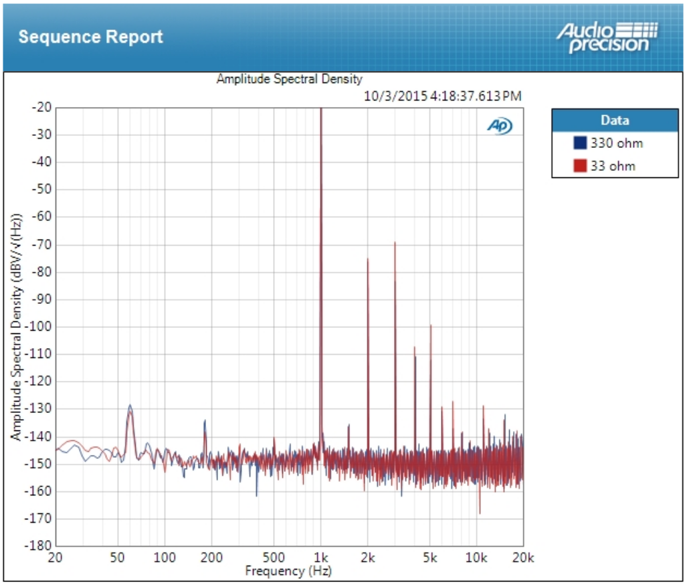
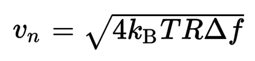
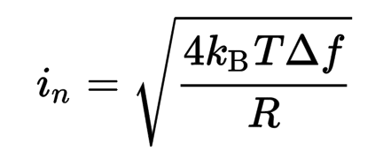
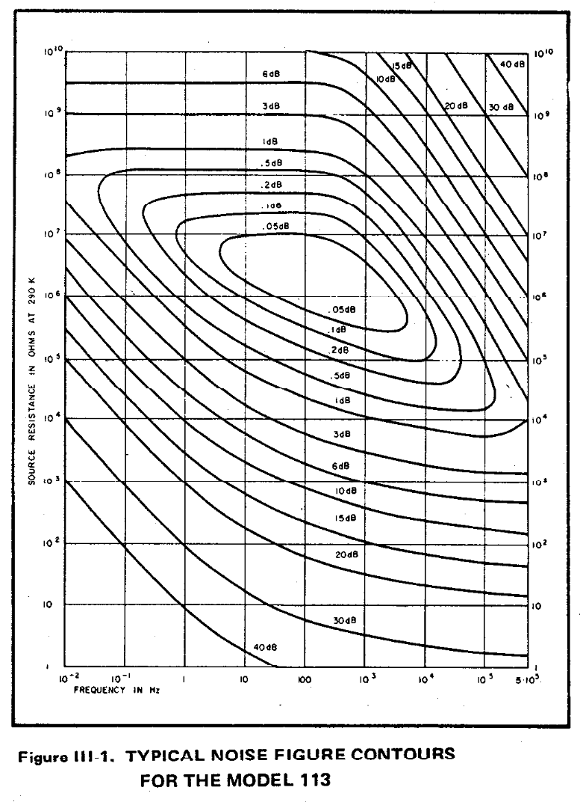
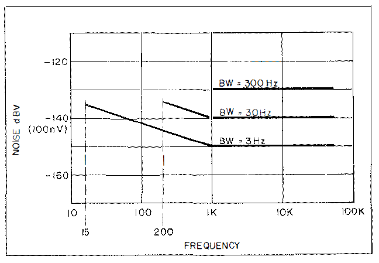
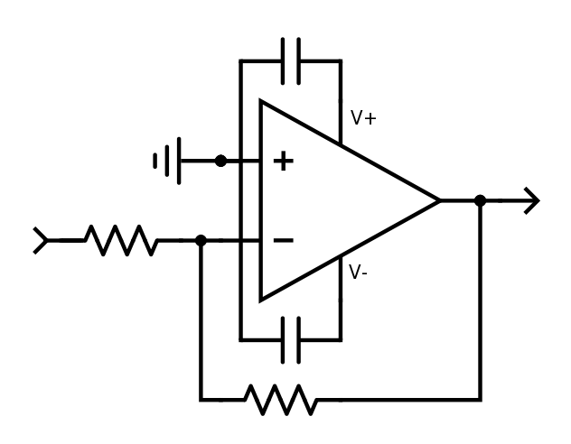

# Measuring Extremely Low Noise Sources

This information relates to tools and techniques related to measuring low noise sources.  Of course 
this is useful in most any discipline where low noise needs to be quantified, but the origin of the 
study in my case is low noise audio amplifiers.  Case in point is [Lilienfeld's Choir](http://auteuraudio.com/lilienfelds-choir) 
that I market under the [Auteur Audio](http://auteuraudio.com/) brand, which exhibits a reported full 
audio spectrum (unweighted) noise level of about 1.7uV RMS into 33 ohms inclusive of spurious 
60 Hertz measurement pickup not related to the noise of the amplifier (lead pickup).  If you discount the 
lead pickup, the noise is under 1uV RMS.

If you look at the spectral graph, particularly in the lower frequency range, say from 100 to 500 Hertz
(discounting the 180 Hertz power line harmonic), you will note that the actual noise density is 
quite low, nearly -150dBV.  This equates to a slightly better than -120dBV wideband audio performance.  If 
you have ever paid attention to the specifications on 
[Audio Precision's high end gear](https://www.ap.com/analyzers-accessories/apx555/), you may note that 
this is getting pretty close to the limits of resolution.  It might be a little tricky
to trust these measurements of this amplifier from 
[PrismSound's dScope gear](http://www.prismsound.com/test_measure/products_subs/dscope/dscope_spec.php)
because of the slightly higher noise floor.  All in all, pretty good performance for an amplifier if 
you have to exercise such care with such quality test equipment.

What all this means is that we can use this amplifier to enjoy 20 bit audio at normal listening levels and 
actually be able to resolve the full depth.  A good homework exercise would be to list for yourself 
the converters that actually best this amplifier in terms of their rated SNR or dynamic range.  This 
should come as an entertaining exercise for some, as the bit depths of converters have generally 
vastly exceeded the SNR over the years, probably as competitive marketing to foolish consumers and to 
provide market expansion potential for the digital volume control folks.  For our purposes 
here we will just glaze over things like noise shaping and keep with the more simplistic view that we 
are doing well if, under normal listening levels, we can create an amplifier that has comparable 
performance with the SNR of the best converters.

The point of this document is to answer the question: "How can I measure my device's performance as well 
(or better) than high end audio test gear, but on a shoestring budget using common equipment and supplies 
found on my workbench?"  Of course the answer to this is understanding the source, amplification and
measurement of noise, which is what this document is really about.  A secondary point of the document is
to reinforce the idea that certain things are perhaps more important than other things in designing an
amplifier.  In my mind, noise and responsiveness are the most critical aspects of a good amplifier.

### Sources Of Noise

There are three types of noise that we are generally interested in:

 * Shot noise
 * Johnson noise
 * Spurious signal noise
 
All three have different causes and origin.  Our biggest concern for this document is the analysis 
of Johnson noise, so we will quickly cover the shot and spurious signal noise so that we can concentrate
on our main interest.

Spurious noise is simply unwanted noise in the environment.  Probably the most ubiquitous source of 
spurious noise is the fundamental and harmonics of the power line.  Being of low frequency it penetrates
enclosures quite well, so the circuit itself needs to have thought put into immunity.  Perhaps the 
most insidious entry point is through the power supply.  Rectification without adequate filtration 
can lead to higher harmonics that are harder to suppress.  Many circuits do not reject power supply
noise all that well, leading to significant problems.  The pervasiveness of the problem is clearly 
seen in the above graph.  The amplifier isn't passing the noise, it is simply picked up in the leads 
on a piece of equipment offering first class resilience to such noise.  Of course there are other
sources of spurious noise, the most common being digital circuits with free running oscillators.  These
clock pulses can be divided and become audible.  One must watch their design carefully when using 
digital components to ensure that these spurious noises are not coupled to the analog stage.  Unfortunately,
there is no practical solution to completely avoid these (batteries are the obvious first choice, you can
find plenty of examples of manufacturers who try to thwart the problem with this approach).  Unfortunately,
it is inevitable that you will run into these problems in todays electrified and connected world.  The 
best thing to do is tackle the problem head-on and without compromise.

Shot noise is noise that originates from Poisson processes.  This means that it is noise originating 
from the occurance of some event that has a probability of happening after some time.  Some electron
moves suddenly and affects the net charge on a gate, for example.  Because of the nature of the noise
model, the noise has an intensity that is inversely proportional to the time interval (and hence the 
frequency), so this type of noise is also often called 1/f noise.  For a great number of low noise 
devices, you will note that there is an indication of some frequency where the 1/f noise becomes 
dominant.  For example, take a look at the datasheet for the [LT1128](http://www.linear.com/docs/3480) 
op-amp.  It cites a 1/f corner frequency, which is the frequency below which the shot noise is significant 
compared with the Johnson noise in the example circuit.  If the device you are interested in does not 
cite information about shot noise, you might reconsider whether or not the product was actually 
intended for low noise application.  The general task as a designer is to position the shot noise so 
that it is below human hearing.  This places your product where the Johnson noise is you primary concern.

### Johnson Noise

Johnson noise, also called thermal noise, is noise that is uniformly distributed by frequency.  That is,
Johnson noise is white noise (whereas shot noise is what you would term pink noise).  The idea of Johnson noise 
was actually established by Nyquist (of sampling fame; Johnson's work involved showing that the idea 
is fundamental to all materials), and is based on the equipartition law of thermodynamics.  The critical
idea is that standing wave oscillation of a lossless transmission line, terminated by resistors to ground
on each side, is a fitting model of some resistor R.  Since each mode contributes the same energy kT, for 
some temperature T, it is then possible to compute the total power associated with the system.  This leads 
us to the familiar equation for the thermal voltage noise of a resistor:

Similarly for the current noise:

 
This is very important to keep in mind, as we will repeatedly refer to this.  In part because it is 
fundamental, in part because one very convenient measure of noise as a baseline is the Johnson noise 
of a resistor having some (normally small) value R.

### Input Impedance and Noise

How input noise affects your circuit is related to the source impedance and the input impedance of you
circuit.  Let's illustrate this with a practical example of an old research amplifier, the EG&G PAR 113,
which has a noise figure plot in the manual:

Most nice equipment, particularly older research equipment, would provide you a figure like this.  As you 
can see, the noise figure is lowest with a source impedance of just over 1 Megohm (and just over
100 Hertz).  On the surface, this curve seems to indicate something intrinsic to the amplifier.  And it 
does to some degree; for example, we can see that it has a very limited low noise bandwidth.  However, the
story has to do with the entire circuit.  Let's discuss a specific example to illustrate.

Suppose you have a rather low source impedance, say 100 ohms.  Further suppose this has a RMS noise voltage
at room temperatue for a 10KHz bandwidth of 127nV (see, told you would would use the noise equation).  This is quite 
low, but note too that the signal is likely quite low given its development into 100 ohms (maybe it is a 
photodetector or some other current source as might be used in a lab).  However, we are also looking at a noise 
figure (from the curve) of about 17dB, which amounts to a 17dB reduction in SNR.  If, however, we were using 
a 1 Megohm source, the noise figure would be very close to zero.  The reason for the higher noise figure 
in great part has to do simply with the impedance mismatch.  Some signal developed over a 100 ohm source 
resistance would have to be amplified significantly more in order to have the same output signal level,
and that imparts noise.  The noise figure is simply a measure of the reduction in SNR because of having to
do this.

If, however, we were to use a 1 Megohm source impedance, we would not have that extra amplification requirement,
and we would be able to keep the noise lower.  The thing to keep in mind, however, is that there is no
free lunch with respect to the input noise.  If you used a 1 Megohm input resistance you would have 100 times
the Johnson noise, or 12.7uV.  What you would typically do for a grossly mismatched impedance for an AC signal
would be to transformer couple the signal with a high quality transformer.  Notice that you don't gain anything
doing this with respect to the noise.  The same square root appears in the arithmetic for the impedance
matching, and you still end up with a souce that *looks like* 1 Megohm and has a thermal noise of 12.7uV.  Grossly
increasing the source impedance simply makes the PAR 113 hard to drive and also exhibits SNR loss (or an
increase in noise figure).

So what is the take away lesson here?  It is really critical to design your circuit with the right input
impedance for the source your are interested in.  For high gain circuits in particular, a prime driver
of the noise is directly related to the input impedance and the input impedance matching.  It is also fairly
handy to have a rough knowledge of the Johnson noise for various impedances, as that gives you a sense of 
what you are designing for.  For example, a 10k resistor has a thermal noise at room temperature and 20KHz 
bandwidth of about 1.8uV.  For a point of reference refering to earlier in the story, what we are saying is 
that inclusive of the power line noise that is a *significant* component of the total noise, and unrelated
to the noise of the amplifier, Lilienfeld's Choir *still* exhibits noise that is lower than what you would experience
if you hooked your headphones up to a 10k resistor.  What we are also saying here is that while some equipment
like the old PAR 113 might seem appealing for helping design these low noise circuits, it really isn't 
appropriate for the typical impedances seen in audio amplifiers.  You really need a much lower noise amplifier
with a much lower input impedance to help understand the noise characteristics of your designs.

### Common Test Equipment

The average person's test bench isn't really geared toward quantifying low noise amplifiers.  The typical
scope generally doesn't go much below 1mV per division.  Unless you splurge on a fairly exotic or expensive 
meter, the accuracy and linearity isn't really all that good, not to mention the very real wonderment of 
exactly what sort of average it would detect with noise, particularly broadband.   There are some very good
meters that can measure noise, an example being thermal balancing meters that introduce a DC current that 
controls the meter movement that balances the heat dissipated by a broadband AC source.  There are also very
good digital meters that compute RMS.  

What I find to be probably the best is a sampling scope.  The reason for this is that generally these scopes 
provide sample averaging that limits the effect of high frequency noise for bandwidth limited sampling, as 
we would use for measuring the audio band.  Moreover, they generally have a number of convenient built-in 
functions such as RMS reporting that operates on the sampled data, giving you reasonable confidence in the 
result since you can tell exactly what it is doing.  You can often export the samples so that you can load
the data and do your own arithmetic if you prefer.  Much of this you could also do using your soundcard, but
I do not have much experience using this route.  The biggest issues I am sure would be feeling confident in
the magnitude of the measurements.  Also, sampling scopes generally have significantly faster possible 
sampling, which you can use to identify other issues.  I would strongly encourage a halfway decent sampling 
scope being on your bench.

There are a number of more exotic pieces that you can use.  The old wave analyzers can be very helpful.  However,
they are generally used as a frequency selective meter, which can be a bit indirect for use with determining
broadband noise.  As well, they are becoming a bit scarce since they haven't been made for a number of years.  If 
you are up for a bit of a challenge and want to learn about a very clever type of older gear, perhaps you would
enjoy learning about the wave analyzers.  Take a look at the noise floor of the venerable HP3581's 
[manual](documents/HP3581Manual.pdf), one of the finest pieces of gear made for the audio range:

For the rest of this discussion on measuring noise, I will presume that you have a sampling scope that has 
reasonable abilities in terms of the lowest measurement range.  This will give us a very good starting point
for what we would need to do in terms of manipulating our minute noise signal so that we can measure it with 
reliability enough to make claims about quantifying the noise.

### Selecting Parts For A Noise Amplifier

Now that we know that one the best tools we could have for quantifying our noise is our bench sampling scope,
and we know that the low level range on our scope is on the order of millivolts, we clearly need to design a 
good quality amplifier that has very low noise.  Moreover, we need to be able to quantify the amplifier itself,
because in the face of measuring other low noise signals, we will likely need to be able to differentiate 
the noise of our source from the noise of the amplifier we are using to make the signal palettable for the
scope.

Of course there are two approaches that can be taken with regard to this preamplifier.  One is the discrete 
approach, the other is the op-amp approach.  In this document I am going to present the op-amp approach.  The
reasons for this are sevaral.  First, device selection is simpler since you are choosing one device rather
than needing to make different device selection for the various parts of the amplifier.  Second, compensating
the circuit requires less nuance than in the discreet case since this is typically done for you.  Third, especial
care is always required of the first stage of any multi-stage amplifier since it is the largest contributor to 
the output noise, and the designers of the low noise op-amps can produce these initial gain stages with a greater
degree of control than you can select discrete components.  There is always a time and place for adding 
a discrete stage, and I am generally a great proponent of this.  However, the practical reality for signal-level
amplification such as this is that the modern low noise op-amp is a very good choice often offering better 
performance, lower cost and signficant simplification of design.  Concern yourself with designing your audio
circuit with discrete components, not the pre-amp for measuring the noise.

When you are looking for a good op-amp for use in a high gain amplifier like this, you are looking for three
major things.  First, you are looking for incredibly low equivalent input noise.  This figure simply indicates
what the intrinsic noise of the amplifier is expressed as an equivalent noise source applied to a zero noise
amplifier.  You will generally find this figure expressed as a noise voltage per bandwidth.  Recall our 
Johnson noise equation, noting that the units for a given resistance and temperature would be volts per 
square root of the bandwidth.  You will generally find the equivalent input noise expressed as nanovolts per 
root Hertz, and you will be selecting a device that has this figure less than one nanovolt per root Hertz.  

Second, you are looking at the inflection point in the noise graph indicative of where the shot noise 
starts dominating the total noise.  This is where the noise attributable to the Poissonian processes in the 
circuit dominate the uniform spectral noise that is a result of components operating above absolute zero 
temperature.  The important thing in any audio application, this one being no different since we are wanting
to quantify a circuit operating in the audio range, is to select a device where the inflection point is as 
low as possible.  For modern low noise op-amps this will likely be a few Hertz.  

Third, you are looking at the gain-bandwidth product of the amplifier, and to a lesser extend it's gain
stability.  I say to a lesser extend the gain stability because we are operating in a low feedback, high
gain mode in this circuit, which avails most amplifiers that may not have unity gain stability.  Regarding
the gain-bandwidth product, you want to have adequate bandwidth at the gain that you require.  Many times
this will imply that you use a less compensated op-amp that perhaps is not unity gain stable in order to
achieve a higher bandwidth at a high gain.  Since we are usually interested in a 20kHz bandwidth, and would
prefer to keep our response reasonably flat at the high end of that range, it would be advisable to actually
design for at least a 50kHz bandwidth, if not more.  If we assume we are designing an amplifier with a gain
of 1000, we would need a guaranteed gain-bandwidth product of at least 50MHz.

By this point I am sure you are seeing some of the reasons why it is convenient to use an op-amp and not 
design the circuit with discrete components.  You would be responsible for all compensation, would have a fairly
hard time specifying the noise of the components, and would be left having to spend a lot of design time 
determining the fitness of your design.  Moreover, the larger circuit would be less immune to picking up
stray signals.  All in all this is an excellent example of a circuit where an op-amp is both a convenient
and good choice.

While I look at other options fairly often, I often personally use Linear Technology's 
[LT1028](http://www.linear.com/docs/3480).  This op-amp sports a very good noise characteristic, a low
shot noise inflection point (of 1/f corner), and a quite respectable gain-bandwidth product.  For measuring 
noise in the normal audio band with gains up to 1000, this is an excellent op-amp to use.  The more
highly compensated LT1128 is also an excellent op-amp, and is very useful for lower gain circuits.

### Designing The Noise Amplifier

There are a few things that are important to keep in mind when designing this little amplifier.  First,
while it may not be practical to use batteries for all of the gear that you might design, this is one
very prominent exception.  You can very easily design your test equipment to use batteries.  This way
you have great portability, isolation to reduce ground-coupled power line noise (extremely useful for a
high gain amplifier), less of a concern with power supply rejection, etc.  Standard alkaline batteries
work just fine, but you could also use lithium batteries.  The lithium iron phosphate chemistry is the
best choice, as it has the lowest electrode noise and the most consistent discharge curve.  

You are designing this amplifier for very high gain.  That said, since your op-amp amplifier is 
basically an actively driven voltage divider, the ratio should be reasonably precise.  Not only that,
but since it needs to have good high frequency performance vis-a-vis the gain-bandwidth product, you
need to be sure to use resistors that are a good fit.  That means little stray capacitance and 
low inductance.  Carbon composition and excessive spiraling of the resistive material are not 
good choices.  

Generally speaking an inverting amplifier will be more stable than a non-inverting amplifier.  In the
inverting amplifier we have the additional benefit of having the non-inverting input grounded, 
which helps with noise.  The equivalent input resistance of the inverting input is the parallel
resistance of the source and feedback resistors, which is roughly the source resistance in 
a high gain amplifier.  If you require a particularly high input impedance, you can use the
op-amp as a non-inverting amplifier, but I am going to presume we are building the inverting
amplifier so long as our device under test can tolerate the relatively low input impedance. 

There are some considerations regarding the general order of magnitude of 
resistor that you will be using.  Since the input noise of the LT1028 is about roughly the 
same as a 50 ohm resistor, you will want to keep the input resistance in that neighborhood.  As an easy 
rule of thumb, you will want to keep the input resistance at least about ten times the value
of the output impedance of the device under test. For example, Lilienfeld's Choir has an output
impedance of about 3 ohms.  I would want to use an input resistance of at least 30 ohms, an 
would not want to exceed maybe a couple hundred ohms lest the noise from the input resistor be 
pretty noticeable.  Something in the 50 to 100 ohm range would be a good choice.  Suppose we 
use the 50 ohm resistor.  Since we need a gain of 1000, we will use a 50k feedback resistor.  

What we want is the simplest circuit with the lowest resistances we can get away with.  That said,
we are not interested in adding any sort of external compensation.  The scope can bandwidth limit
the signal, we do not have interest in doing that.  We want the leads to this amplifier to be as 
short as possible while being useful, so limiting to a few inches is generally ideal.  Since the 
circuit is tiny and operates on batteries, this is generally easy to achieve.  Despite using 
batteries for power, we do not want any power supply induced feedback that could cause 
oscillation in our quite sensitive high gain amplifier circuit.  It is useful to decouple the 
power supply pins with high quality capacitors.  Despite your scope being pretty good at rejecting
common mode noise, we don't want to test that, so it is wise to run the output signal on shielded
cable, and it may as well be BNC terminated so it works well with your scope.

Here is an example:

You couldn't ask for a simpler amplifier.  There is nothing to it other than making good decisions
about the components and paying attention to the layout.  You want to keep stray capacitance to a
minimum and keep lead lengths short.  As short as possible on the input since it will be *very* sensitive 
to environmental noise.  Having the lower input impedance helps with this, as does the assumption that
you can position your testing setup away from these types of noise.  If these considerations are not
true then you will need to reconsider how you are approaching this problem.  You may need to consider 
reconfiguring the amplifier to use the non-inverting input to afford higher input impedance, or even
design an instrumentation amplifier so that you can achieve better common mode rejection.  You may
want to consider placing a simple RC high pass filter after the amplifier to reject low frequency
shot noise.  There are a lot of things that you should consider and make decisions about when you are 
actually implementing this amplifier.  The point of this introduction is not to provide prescription
on how to do it, but more to get you thinking about the salient issues and the fact that you can often
design a better amplifier than you could buy assembled with minimum parts count for an application like this.

### How To Interpret Your Amplifier

If you are attempting to measure signals with noise in the microvolt range in the full audio band, you will
inevitably see the noise of even a very low noise amplifier such as the one detailed above.  You will need
to be able to account for all of the noise, much of it being noise that you will need to estimate 
analytically.  The noise at the input of a high gain amplifier is by far the most important, so we will 
not worry much about anything else.  In this amplifier, you will have three main sources of noise:

 * Intrinsic input noise of the op-amp
 * Noise of the source resistor
 * Noise of your amplifier
 
If we suppose a bandwidth of 20KHz, we are looking at an input noise from the amplifier of about 120nV.  Using 
the same bandwidth and assuming a temperature of 20 degrees Celsius, the 50 ohm source resistor will 
generate another 127nV.  It is important to recall that uncorrelated noise adds in terms of power, not in terms
of voltage, so the sum of these two noises is actually 175nV.  That is to say, if you were to short the input
to ground in a perfectly isolated from environmental noise situation, you would anticipate an input noise of 
175nV.  Since we have a gain of 1000, the noise that would be presented to the scope is
1000 times this figure, or 175uV.  Since we were discussing a full scale deflection of a millivolt for performing
our measurements, this is not insignificant.  Despite creating an amplifier with a total input noise on par with
a 100 ohm resistor, given the gain we are using the noise is almost 20% of full scale if full scale is a 
millivolt.  Obviously you should actually measure what you are experiencing in practice, as the gain may not 
be precise, the op-amp may not perform at exactly the rated noise, etc.  This gets us to the issue of how to 
measure the noise on the scope in the first place.  

Many sampling scopes effectively average the signal to achieve a lowered bandwidth.  That is, while the scope may 
sample significantly faster than you are asking it to report, each recorded sample is the average of many 
intermediate samples.  This is one way of accomplishing signal average, though there are others that various
scopes may use.  The same can be true for other types of equipment, such as general purpose analog to digital 
converters, but the focus is often less on details like signal averaging.  However, signal averaging is an important
aspect of why we decided to use the sampling scope in the first place.  The reason for this is because the 
magnitude of the noise is related to the bandwidth, and we are wanting to have a fixed bandwidth that is lower
than the maximum bandwidth of the scope.  If we did not have signal averaging, we would be reporting a much 
higher noise than we would be expecting.  If we do us use signal averaging, then we can safely use metrics 
computed from the sampled data regarding the magnitude of the noise.  

If we believe that the sample is averaged over each sample for a given bandwidth, then in any measurement 
period of the scope (the full screen draw), we will have a collection of data that we can compute metrics 
from.  What we are interested in is the standard deviation, which is the square root of the variance.  The
reason for this is that it is a measure of the size of the noise distribution, in the same units as the 
base measurement.  Analytically, we would compute this as the square root of the sum of the squared 
distances from the mean.  However, the scope will do this for you, and it will call it the AC RMS 
voltage.  The average DC voltage is effectively the mean, and the AC RMS voltage is the exact same 
arithmetic as computing the standard deviation.  In order for this to be sensible, we need to feel 
that the noise appears to be randomly distributed.  That is, there are no underlying undulations from
power line interference, external noises, etc.  If we have those features, we would want to attempt to
compensate for them.  Most sampling scopes will allow you to do some sort of signal averaging, which can
have the effect of easily displaying *correlated* signals that can be hard to see in a single
sweep.  If you have these spurious features, attempt to determine their magnitude precisely and 
compensate for them.

Now that you have a clean or compensated noise signal and know that you can use the AC RMS reporting from the scope
to determine the standard deviation of the noise, we can take measurements.  Suppose from our previous
evaluation of the baseline amplifier noise that we in fact had a 175uV AC RMS measurement on the scope.  Now 
we are going to connect it to the device under test, and we are reading an AC RMS measurement of 750uV AC 
RMS.  Again, these are *uncorrelated* noise signals, so they add in terms of power.  That is to say, 
175uV squared + *something* squared = 750uV squared.  That something clearly is 730uV.  If the noise is dominant,
even by this somewhat small factor (750uV versus 175uV), you can generally estimate it simply by taking
the total noise measurement alone.  If, however, the two are more similar in value, you will need to perform
the calculation.  Suppose the total was 250uV rather than 750uV.  In this case, the contribution from the 
device under test is about 180uV.  Of course the pre-gain values of these figures are in nanovolts.  The limit 
of this approach will be when the noisy signal you are measuring is much smaller than the noise of the 
amplifier.  For correlated signals there are ways of recovering the underlying 
smaller signal (think of lock-in amplifiers), but for uncorrelated noise you need the best low noise amplifier 
you are willing to afford or build.  

So long as you have a clean noise signal, with all correlated aspects of the signal accounted for, this will give you 
the unweighted, or broadband, audio noise.  Weighting is generally a means of making the figures looks 
better by attenuating portions of the band, thereby reducing the reported noise.  While there may be some 
rationale for it because of the dynamics of the human ear, it is generally used to make equipment appear better
in specifications than it is.  

### Conclusion

The point of this document was to arm you with very basic knowledge of how to specify and test low noise 
equipment.  There are many pieces of great gear out there for testing audio equipment, the Audio Precision gear 
being some of the best, but it still leaves a gap in precise measurement of equipment that has output noise 
on the order of the test equipment noise floor.  Fortunately, with some thought, it isn't all that hard to 
do a good job quantifying these low level noise measurements using common bench equipment.  Armed with what 
has been presented here, you ought to be able to use commonly available parts and bench equipment to measure 
broadband noise voltages down to roughly the 100nV level.  For all but the most demanding tasks, this should be 
sufficient.
